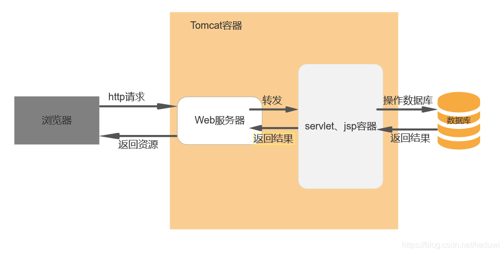
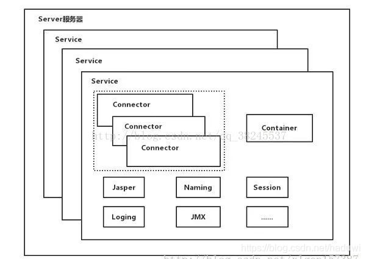
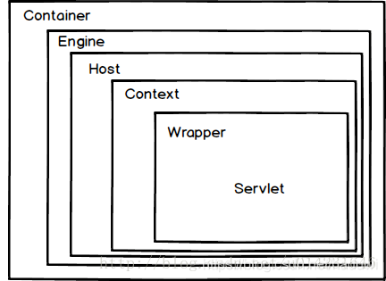

# 概念
Tomcat是一个开源的轻量级Web应用服务器，专注于处理Servlet和JSP等动态内容，适合于中小型系统和并发量较低的场景。

# 原理
Tomcat结构图：

Tomcat主要组件：服务器Server，服务Service，连接器Connector，容器Container；连接器Connector和容器Container是Tomcat的核心。
## 两大组件
1、Connector
Connector组件是Tomcat中的两个核心组件之一，它的主要任务是负责接受浏览器发送过来的TCP连接请求，创建一个Request和Response对象分别用于和请求端交换数据。然后产生一个线程来处理这个请求并把产生的Request和Response对象传递给处理给处理这个请求的线程，处理这个请求的线程就是Container组件的工作。
2、Container
Container结构图：

