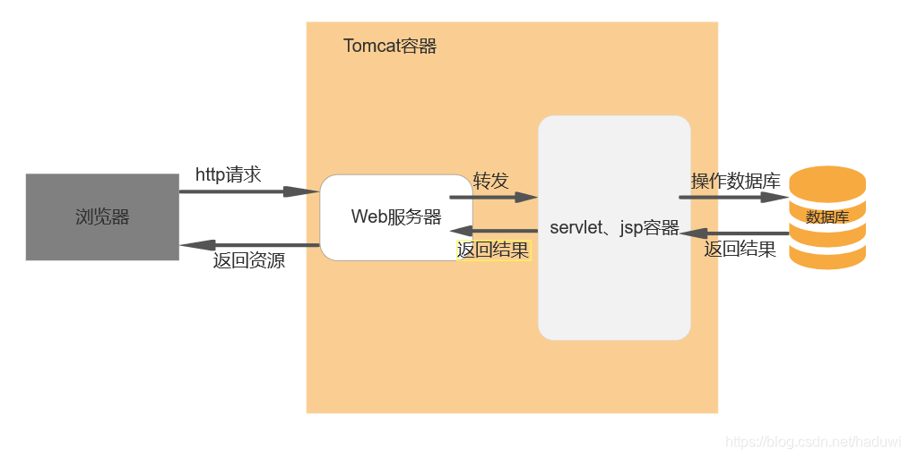
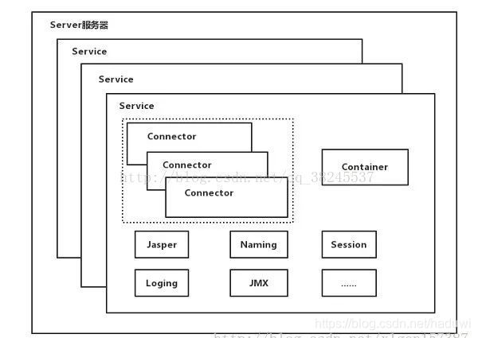
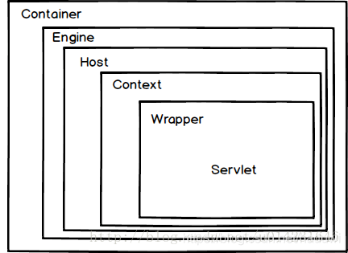

# 概念
Tomcat是一个开源的轻量级Web应用服务器，专注于处理Servlet和JSP等动态内容，适合于中小型系统和并发量较低的场景。

# 原理
  
Tomcat主要组件：服务器Server，服务Service，连接器Connector，容器Container；连接器Connector和容器Container是Tomcat的核心。  
## 两大组件
1、Connector  
它是Tomcat与外界的交通枢纽，监听端口接受外界请求，并将请求处理后传递给容器做业务处理，最后将容器处理后的结果反馈给外界。  
2、Container()  
  
负责对内处理业务逻辑。其内部由Engine、Host、Context和Wrapper四个容器组成，用户管理和调用Servlet相关逻辑。  
